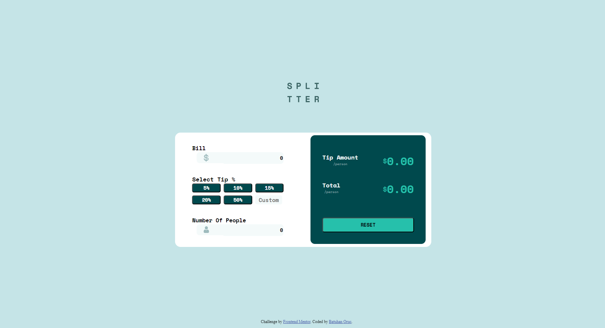

# Tip Calculator

Bu proje, Frontend Mentor sitesindeki bir challenge'den esinlenerek oluşturulmuş bir bahşiş hesaplama uygulamasıdır.

## Projeyi Başlatma

Proje dosyalarını bilgisayarınıza indirin ve aşağıdaki adımları izleyerek live serverda çalıştırın.

### Kurulum

1. Proje dosyalarını indirin:

   ```
   git clone https://github.com/kullanici/tip-calculator.git
   ```

2. Proje dizinine gidin:

   ```
   cd tip-calculator
   ```

3. Projeyi Live Server ile başlatın

4. Tarayıcınızda `http://localhost:3000` adresine gidin.

## Proje Görünümü

Aşağıda proje hakkında birkaç ekran görüntüsü bulunmaktadır:


